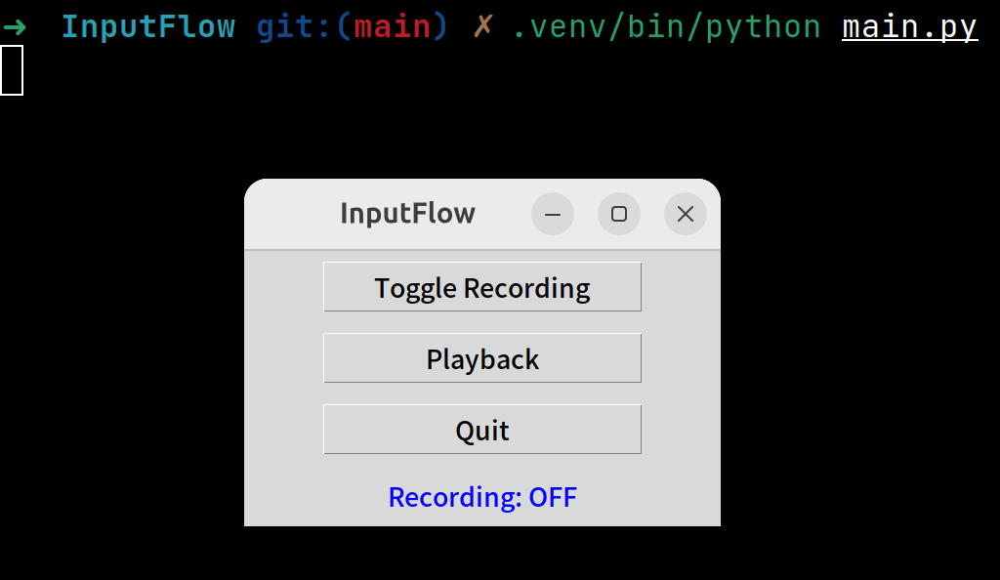

# InputFlow

**InputFlow**는 Ubuntu 24.04 LTS에서 동작하는 **키보드 + 마우스 매크로 기록 및 재생 프로그램**입니다.
터미널과 GUI에서 모두 사용 가능하며, 녹화된 입력을 그대로 재생할 수 있어 반복 작업이나 테스트 자동화에 유용합니다.

---

## 주요 기능

- 키보드 입력 및 마우스 클릭 기록
- 기록된 이벤트 순서 및 시간 간격 그대로 재생
- 터미널 또는 GUI에서 **녹화 ON/OFF, 재생, 종료** 가능
- Ubuntu 24.04 LTS 친화적 (`pynput` 사용)
- 향후 GUI 개선 및 이벤트 파일 저장/불러오기 지원 예정

---

## 설치 (가상환경 권장)

```bash
# 필수 패키지 설치
sudo apt update
sudo apt install python3-pip python3-venv python3-tk -y

# 프로젝트 폴더에서 가상환경 생성
cd /home/ktw/projects/InputFlow
python3 -m venv .venv

# 가상환경 활성화
source .venv/bin/activate

# 필수 Python 라이브러리 설치
pip install --upgrade pip
pip install pynput
```

---

## 실행 방법

### 터미널 버전

```bash
python main.py
```

- **F6** → 녹화 ON/OFF
- **F7** → 기록된 이벤트 재생
- **ESC** → 프로그램 종료

---

### GUI 버전 (Tkinter)

```bash
python main.py
```

- **Toggle Recording 버튼:** 녹화 ON/OFF
- **Playback 버튼:** 기록된 이벤트 재생
- **Quit 버튼:** 프로그램 종료
- 상태 표시 라벨로 현재 녹화/재생 상태 확인 가능

#### GUI 버튼 구조 예시

```
+----------------------+
|  InputFlow           |
+----------------------+
| [Toggle Recording]   |
| [Playback]           |
| [Quit]               |
+----------------------+
| Status: Recording OFF|
+----------------------+
```

#### GUI 실행 화면 예시



---

## 사용 예시

1. **녹화 시작:** F6 또는 GUI 버튼 Toggle Recording
2. **입력 기록:** 키보드 입력 + 마우스 클릭
3. **녹화 종료:** F6 또는 Toggle Recording 버튼 다시 클릭
4. **재생:** F7 또는 Playback 버튼
5. **종료:** ESC 또는 Quit 버튼

---

## 주의사항

- Ubuntu 환경에서 **Xorg 세션**에서 실행 권장 (Wayland 환경에서는 일부 기능 제한 가능)
- 기록 재생 시 현재 활성 창에 입력 전달
- 녹화/재생 중 다른 앱 단축키와 충돌 주의
- 테스트 시 안전한 환경에서 먼저 실행 권장

---

## 향후 계획 (GUI 강화)

- GUI 버튼으로 녹화/재생/종료 기능 강화
- 기록 시 클릭/키 입력 시 이펙트 추가
- 기록된 입력 **파일 저장/불러오기**
- 재생 시 **랜덤 딜레이** 적용 → 자연스러운 입력
- **반복 재생** 루프 기능 추가
- **단축키 지정** 기능 추가
